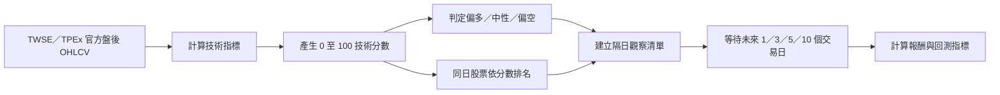

# 推薦策略說明

本文說明 Taiwan Alpha Radar 目前如何產生每日選股訊號、各項分數代表什麼，以及建議如何解讀結果。

> 本系統目前定位為「盤後研究與隔日觀察清單」，不是即時看盤、精準價格預測或自動下單系統。

## 1. 策略結論

現階段建議以 **`technical_eod_v1` 每日技術預測**作為主要選股依據，完整 **Alpha Score** 作為介面展示與未來擴充架構。

原因如下：

- `technical_eod_v1` 只使用 TWSE／TPEx 官方盤後 OHLCV，可追溯、可重算，也能做 walk-forward 回測。
- 完整 Alpha Score 的價格與技術面是真實資料，但籌碼、基本面及新聞目前仍是 mock。
- 因此，現階段不能把完整 Alpha Score 的「強力推薦／推薦」直接視為真實投資訊號。

兩套訊號應分開理解：

| 訊號 | 用途 | 資料狀態 | 現階段可信用途 |
|---|---|---|---|
| `technical_eod_v1` | 每日盤後排行與方向預測 | 官方盤後價量 | 主要研究訊號、回測驗證 |
| Alpha Score | 五維度綜合評分 | 技術真實，其他維度模擬 | 展示、架構驗證、輔助觀察 |

## 2. 每日預測流程

系統預設於台北時間每日 18:00 執行分析，流程如下：



每個交易日的預測只使用當日及以前的資料，不使用未來價格。預測基準價為該日收盤價，適合回答：

> 今天收盤後，哪些股票的技術狀態相對較強，值得列入下一個交易日的觀察清單？

它不回答盤中最佳買點，也不保證下一日收盤一定上漲。

## 3. `technical_eod_v1` 計分方式

技術分數由 50 分開始，最後限制在 0 至 100 分。至少需要 25 筆收盤資料；不足時給予 50 分中性分數。

### 3.1 趨勢結構

使用收盤價與 5、20、60 日均線：

| 條件 | 分數調整 |
|---|---:|
| 收盤價 > MA5 > MA20 > MA60 | +18 |
| 收盤價 < MA5 < MA20 < MA60 | -18 |
| 非完整排列，但收盤價站上 MA20 | +6 |
| 非完整排列，且收盤價跌破 MA20 | -6 |

### 3.2 20 日動能

20 日漲跌幅乘以 `0.6`，貢獻限制在 `-15` 至 `+15` 分。

```text
動能加分 = clamp(20 日漲跌幅 × 0.6, -15, +15)
```

### 3.3 RSI

| RSI(14) 條件 | 分數調整 | 解讀 |
|---|---:|---|
| 50 至 70 | +8 | 趨勢處於相對強勢區 |
| 大於 80 | -6 | 短線過熱 |
| 小於 30 | -4 | 動能弱、買盤不足 |

### 3.4 成交量確認

若當日成交量高於前 20 日平均量的 1.3 倍，而且當日收盤上漲，增加 6 分。

這項設計用於區分「有量支持的上漲」與單純價格波動。

## 4. 方向、信心與排名

### 4.1 方向

| 技術分數 | 系統方向 |
|---:|---|
| 60 分以上 | 偏多 |
| 40 分以下 | 偏空 |
| 40 至 60 分之間 | 中性 |

### 4.2 信心分數

信心代表技術分數偏離中性 50 分的程度，不是實際勝率：

```text
信心 = min(100, abs(技術分數 - 50) × 2)
```

例如技術分數 70 分時，信心為 40；技術分數 50 分時，信心為 0。

### 4.3 排名

系統將同一交易日的股票依技術分數由高到低排列。排名表示股票在目前追蹤範圍內的**相對強弱**，不是全體台股排名。

## 5. 建議使用方式

建議把結果當成兩層篩選，而不是直接的買賣指令。

### 第一層：主要觀察名單

- 先看「預測驗證」頁面的最新 Top 10。
- 以方向為「偏多」的股票為主要候選。
- 確認資料日期是最近一個已完成的交易日。
- 排除停牌、資料缺漏或當日價格明顯異常的標的。

### 第二層：較嚴格的研究條件

以下是建議的研究規則，目前尚未寫成自動交易邏輯：

- 技術分數至少 60 分。
- 若希望減少訊號數量，可提高至 70 分；依目前公式，這也代表信心至少 40。
- 不因單日排名直接重押，應搭配流動性、風險承受度與部位上限。
- 若隔日大幅跳空，不能假設仍能以預測日收盤價成交。

### 每日 SOP

1. 收盤資料完成後執行 pipeline。
2. 確認 `data_source` 為 `twse_tpex_official`，並核對資料日期。
3. 查看 Top 10、方向、技術分數與信心。
4. 參考 1／3／5／10 日回測，不只看單一期間。
5. 將候選股列為下一交易日觀察名單，不把分數當作保證。
6. 定期記錄實際結果，檢查策略是否在近期市場狀態下失效。

## 6. 回測如何計算

系統以 walk-forward 方式，在每個歷史交易日只使用當時已知資料產生預測，再等待未來價格驗證。

預設設定：

- 市場歷史資料：180 個交易日。
- 預測回看範圍：最近 120 個可預測交易日。
- 驗證期間：未來 1、3、5、10 個交易日。
- 選股組合：每日排名前 25%，最多 10 檔；目前追蹤 40 檔時即為 Top 10。

主要指標：

| 指標 | 定義 |
|---|---|
| 平均報酬 | 每日入選股票由預測日收盤至指定交易日收盤的平均報酬 |
| 基準報酬 | 同日、同期間，追蹤股票池所有可計算股票的等權平均報酬 |
| 超額報酬 | 入選股票報酬減去基準報酬 |
| 勝率 | 入選股票指定期間報酬大於 0 的比例 |
| 方向準確率 | 偏多後上漲、偏空後下跌；中性則以絕對報酬小於 1% 為正確 |

回測重點應優先看：

1. 不同期間的超額報酬是否多數為正。
2. 樣本數是否足夠。
3. 結果是否只由少數股票或特定行情貢獻。
4. 策略近期表現是否明顯低於完整歷史期間。

## 7. 完整 Alpha Score

完整 Alpha Score 由五個維度加權：

```text
技術面 30% + 籌碼面 25% + 基本面 20% + 題材面 15% + 風險面 10%
```

| 維度 | 主要內容 | 目前資料狀態 |
|---|---|---|
| 技術面 | 均線、20 日動能、RSI、量價 | 官方盤後資料 |
| 籌碼面 | 三大法人、外資持股、融資變化 | mock |
| 基本面 | ROE、營收成長、本益比、毛利率、殖利率 | mock |
| 題材面 | 題材熱度、新聞情緒 | 靜態熱度 + mock 新聞 |
| 風險面 | 年化波動、60 日最大回檔、RSI 過熱 | 官方盤後資料 |

總分標籤如下：

| Alpha Score | 顯示標籤 |
|---:|---|
| 80 分以上 | 強力推薦 |
| 70 至 79.9 | 推薦 |
| 55 至 69.9 | 區間偏多 |
| 45 至 54.9 | 觀望 |
| 45 分以下 | 偏空 |

在籌碼、基本面與新聞改接真實來源並完成回測以前，這些標籤不應作為實際交易建議。

## 8. 市場與族群分數

市場溫度由以下項目組成：

```text
上漲家數廣度 40% + 指數強度 35% + 平均 Alpha Score 25%
```

族群強度則使用：

```text
族群平均 Alpha Score 70% + 當日平均漲跌動能 30%
```

由於兩者都包含完整 Alpha Score，目前也會間接受 mock 維度影響，適合用來理解產品呈現，不宜視為已驗證的市場擇時模型。

## 9. 已知限制

目前回測尚未納入：

- 手續費、交易稅、滑價與買賣價差。
- 開盤跳空造成無法以預測日收盤價成交的差異。
- 部位大小、資金上限、停損、停利與再平衡規則。
- 除權息、分割等公司行動的完整還原處理。
- 固定股票池可能產生的存活者偏誤與選股範圍偏誤。
- 大盤、產業、波動環境等不同市場狀態的分層驗證。
- 長期樣本與樣本外驗證。

因此回測結果是研究證據，不等於未來可實現報酬。

## 10. 後續策略演進

建議依以下順序擴充：

1. 增加歷史期間，建立穩定的樣本外驗證。
2. 納入交易成本、最大回撤、報酬波動與資金曲線。
3. 增加流動性門檻及異常價格資料檢查。
4. 接入真實三大法人與融資融券資料，獨立驗證籌碼訊號。
5. 接入公開資訊觀測站財報與月營收，獨立驗證基本面訊號。
6. 各維度通過驗證後，再重新校準 Alpha Score 權重與推薦門檻。

在完成以上步驟以前，最合理的產品定位仍是：

> 使用真實盤後資料建立每日候選清單，透過持續回測驗證訊號品質，而非提供即時交易指令。

## 11. 免責聲明

本專案所有評分、方向、信心與回測結果僅供軟體開發及投資研究，不構成買賣建議。任何實際交易決策都應另外評估個人風險承受能力、流動性與市場狀況。
